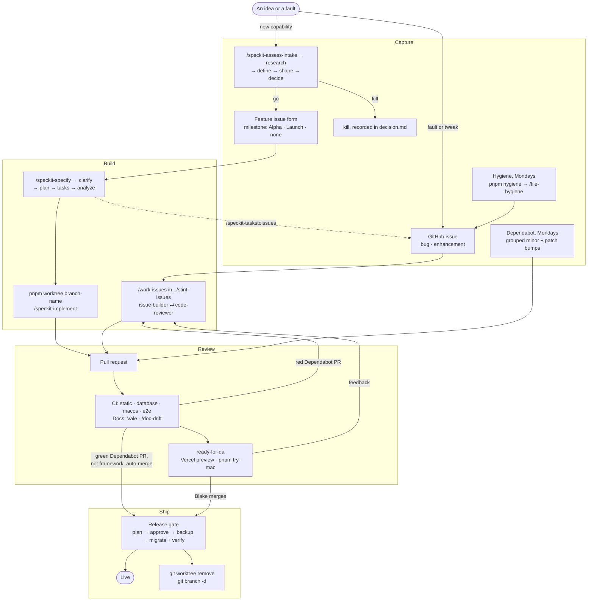

# From idea to production

Every piece of work, from the moment it is noticed to the moment it is live,
with the command that moves it at each step.

```mermaid
flowchart TD
  idea([An idea or a fault])

  subgraph Capture
    issue["GitHub issue<br/>bug · enhancement"]
    assess["/speckit-assess-intake → research<br/>→ define → shape → decide"]
    feature["Feature issue form<br/>milestone: Alpha · Launch · none"]
    killed["kill, recorded in decision.md"]
    hygiene["Hygiene, Mondays<br/>pnpm hygiene → /file-hygiene"]
    deps["Dependabot, Mondays<br/>grouped minor + patch bumps"]
  end

  subgraph Build
    spec["/speckit-specify → clarify<br/>→ plan → tasks → analyze"]
    impl["pnpm worktree branch-name<br/>/speckit-implement"]
    wi["/work-issues in ../stint-issues<br/>issue-builder ⇄ code-reviewer"]
  end

  subgraph Review
    pr["Pull request"]
    ci["CI: static · database · macos · e2e<br/>Docs: Vale · /doc-drift"]
    qa["ready-for-qa<br/>Vercel preview · pnpm try-mac"]
  end

  subgraph Ship
    release["Release gate<br/>plan → approve → backup → migrate + verify"]
    live([Live])
    cleanup["git worktree remove<br/>git branch -d"]
  end

  idea -->|fault or tweak| issue
  idea -->|new capability| assess
  assess -->|go| feature
  assess -->|kill| killed
  hygiene --> issue
  feature --> spec
  spec --> impl
  spec -.->|/speckit-taskstoissues| issue
  issue --> wi
  impl --> pr
  wi --> pr
  deps --> pr
  pr --> ci --> qa
  ci -->|red Dependabot PR| wi
  ci -->|green Dependabot PR,<br/>not framework: auto-merge| release
  qa -->|feedback| wi
  qa -->|Blake merges| release
  release --> live
  release --> cleanup
```
