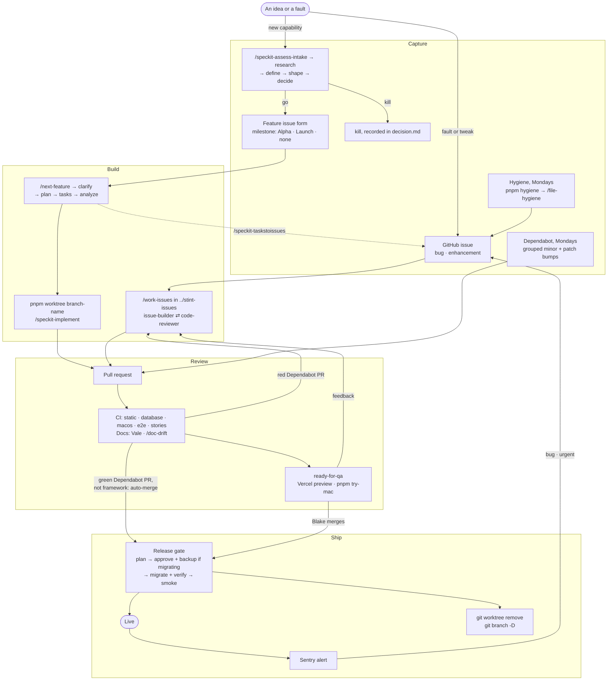

# From idea to production

Every piece of work, from the moment it is noticed to the moment it is live,
with the command that moves it at each step.

## Capture

**Unbuilt work splits on one question: does it need a spec?** A new
capability or an expansion does. It is assessed with `/speckit-assess-*`,
filed through the **Feature** issue form, whose four questions are the gate,
and built through Spec Kit. Everything smaller is a GitHub issue: a fault
labeled `bug` plus its cost (`wrong data`, `misleading`, `looks wrong`, worst
first), or an improvement to something that exists, labeled `enhancement`.
One filed with `gh` answers the form's fields under the same labels. The PR
that does it closes it.

**Two milestones, and they are gates:** `Alpha`, a handful of friends using
it for real, and `Launch`, a stranger paying. An issue in neither is wanted
and not committed to. `urgent` orders within one.

## Review

Every PR reaches QA the same way, whether `/work-issues` built it or not:

- **The branch name is under 30 characters.** It becomes the preview's URL,
  and Vercel hashes a longer one.
- **The body fills the template's Try it**, linking the preview signed in as
  `pr-<n>@preview.test`, which `preview-db` seeds from the branch.
- **`migration` labels a PR that adds one.** The previews share one schema,
  so one such PR is open at a time.
- **`ready-for-qa` goes on once CI is green.**
